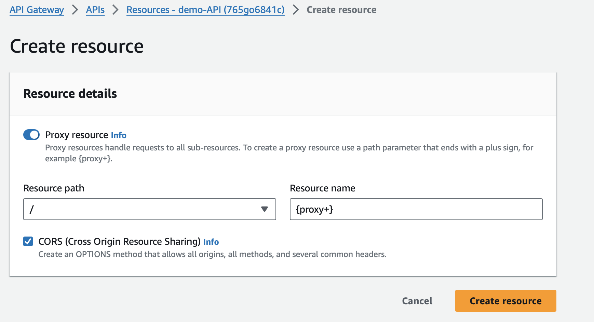

# Pinterest Data Pipeline using AWS, Databricks, Spark, Airflow, Kinesis, Kafka and API Gateway

Pinterest crunches billions of data points every day to decide how to provide more value to their users. 

In this project, we will create a similar system using the AWS Cloud.

## Setting up the Pinterest infrastructure

To begin, I will need infrastructure similar to what a Pinterest data engineer would be working with. For this I used the user_posting_emulation.py script. This script contains login details for a RDS database with three tables that resemble the data received by the Pinterest API when a POST request is made by a user uploading data. This will provide us with the data to work with throughout the project. 

The three tables in the RDS include: 

    1. pinterest_data: contains data about posts being uploaded to Pinterest.
    2. geolocation_data: contains data about the geolocation of each Pinterest post found in pinterest_data
    3. user_data: contains data about the user that has uploaded each post found in pinterest_data

## Configuring the EC2 Kafka Client

In this step we will be configuring an EC2 instance to use as a Kafka Client to perform batch processing of the Pinterest data. The EC2 instance has already been created and deployed, for information on how to achieve this please look [here](https://docs.aws.amazon.com/AWSEC2/latest/UserGuide/EC2_GetStarted.html).

1. Save the .pem file specific to your EC2 instance locally. This will allow us to connect to our client machine via SSH. 

Remember to either include this file in your .gitignore or use Github Secrets to ensure this doesn't get compromised. 

2. Connect to the EC2 instance via SSH:
```bash
ssh -i /path/key-pair-name.pem instance-user-name@instance-public-dns-name
```
3. An IAM authenticated MSK cluster has already been setup, to connect to this cluster we will have to install the appropriate packages:

- First we will need to install Java on our instance by running the following command:
```bash
sudo yum install java-1.8.0
```

- Next we will install and unzip Apache Kafka on our EC2 instance making sure it is the same version as the one our MSK cluster is running on. 

```bash
wget https://archive.apache.org/dist/kafka/2.8.1/kafka_2.12-2.8.1.tgz
tar -xzf kafka_2.12-2.8.1.tgz
```

- Our MSK Cluster uses IAM authentication to ensure safe security practices regarding an organisations resources. To connect to the cluster we will need to install additional steps by firstly navigating to the 'libs' folder of our kafka installation folder:

```bash
cd kafka_2.12-2.8.1/libs/
```
Then downloading the IAM MSK authentication package from Github, using the following command. This package is necessary to connect to MSK Clusters that require IAM authentication:

```bash
wget https://github.com/aws/aws-msk-iam-auth/releases/download/v1.1.5/aws-msk-iam-auth-1.1.5-all.jar
```
- Before our EC2 instance is able to use IAM for cluster authentication we will need to edit the trust policy in our IAM console. For this:

```
Navigate to the IAM console on your AWS account

Here, on the left hand side select the Roles section

You should see a list of roles, select the one corresponding to your EC2 instance

Copy this role ARN and make a note of it, as we will be using it later for the cluster authentication

Go to the Trust relationships tab and select Edit trust policy

Click on the Add a principal button and select IAM roles as the Principal type

Replace ARN with the ARN you have just copied 
```

- To ensure the Amazon MSK IAM libraries are accessible to the Kafka client we will need to set up a CLASSPATH variable. This will allow the client to locate and utilise the necessary libraries. 

    To do this we can use the following command
```bash
export CLASSPATH=/path/aws-msk-iam-auth-1.1.5-all.jar
```

additionally, we can add this command to our ./bashrc file to ensure this environment variable persists across sessions. 

- Next we need to add the configuration settings in a 'client.properties' file in the bin folder of our kafka installation. 

    To do this first navigate to the bin folder of your kafka installation
```bash
cd kafka_2.12-2.8.1/bin/
```
Create a client.properties file:
```bash
nano client.properties
```
Edit this file to include the following configuration settings:
```bash
# Sets up TLS for encryption and SASL for authN.
security.protocol = SASL_SSL

# Identifies the SASL mechanism to use.
sasl.mechanism = AWS_MSK_IAM

# Binds SASL client implementation.
sasl.jaas.config = software.amazon.msk.auth.iam.IAMLoginModule required awsRoleArn="Your Access Role";

# Encapsulates constructing a SigV4 signature based on extracted credentials.
# The SASL client bound by "sasl.jaas.config" invokes this class.
sasl.client.callback.handler.class = software.amazon.msk.auth.iam.IAMClientCallbackHandler
```
4. The final part concerning configuration of the instance is to create the topics for the cluster we will be using. We will need to create three topics, each corresponding to one of the RDS tables referenced in our user_posting_emulation.py script. 

- First we will need to head to the MSK Console on AWS to retrieve the Bootstrap servers string and the Plaintext Apache Zookeeper connection string for our cluster. These will allow us to connect to the cluster and create topics. Save these strings. 

- To create a topic we need to first make sure we are in the /bin folder of our kafka installation. From here we can run the following command to create a topic. Replacing the BootstrapServerString and <topic_name> with the values required. 

```bash
./kafka-topics.sh --bootstrap-server BootstrapServerString --command-config client.properties --create --topic <topic_name>
```

## Connecting the MSK Cluster to an S3 Bucket   

In this step we will use MSK Connect to connect the MSK cluster to an S3 bucket such that any data going through the cluster will be automatically saved and stored in a dedicated bucket. 

MSK Connect allows you to deploy fully managed connectors that move data into or pull data from popular data stores like Amazon S3 which makes it extremely useful in conjuction with MSK clusters to efficiently feed or save data to and from our clusters. 

After creating an S3 bucket with the appropriate permission policies we will go through the following steps to successfully connect our cluster with the S3 bucket: 

1. The first step is to install the Confluent.io Amazon S3 Connector on our client machine, we can do this using the command line

 ```bash
# assume admin user privileges
sudo -u ec2-user -i
# create directory where we will save our connector 
mkdir kafka-connect-s3 && cd kafka-connect-s3
# download connector from Confluent
wget https://d1i4a15mxbxib1.cloudfront.net/api/plugins/confluentinc/kafka-connect-s3/versions/10.0.3/confluentinc-kafka-connect-s3-10.0.3.zip
# copy connector to our S3 bucket
aws s3 cp ./confluentinc-kafka-connect-s3-10.0.3.zip s3://<BUCKET_NAME>/kafka-connect-s3/
```

If everything ran successfully you should be able to see the zip file in your S3 bucket using the AWS console. 

We will use this package to create a custom plugin. 

2. After the package has been saved in the S3 bucket we can navigate to the MSK console on AWS. Under the MSK connect section we will choose 'Create Custom Plugin' which will allow us to choose our desired bucket. Pick the bucket containing the zip file from the previous step and choose the zip file. Now we can click 'create plugin'. 

 Once the plugin has been created we are now able to create the connector which will allow us to send data from the cluster to our S3 bucket. 

3. Under the MSK Connect section in the MSK console there is a tab for called 'connectors' this will allow us to create a connector. Choose 'Create Connector' here. You will be asked to choose the plugin for the connector, click on the one we created in the previous step. Create a name for your connector and then choose your desired MSK cluster from the list. 

After this we need to change the configuration settings for our connector. The configuration that will work in my case may be different to yours so you may need to edit it to your relevant configuration. 

The configuration settings I will be using are: 

 ```bash
# assume admin user privileges
connector.class=io.confluent.connect.s3.S3SinkConnector
# same region as our bucket and cluster
s3.region=us-east-1
flush.size=1
schema.compatibility=NONE
tasks.max=3
# include nomeclature of topic name, given here as an example will read all data from topic names starting with msk.topic....
topics.regex=<YOUR_UUID>.*
format.class=io.confluent.connect.s3.format.json.JsonFormat
partitioner.class=io.confluent.connect.storage.partitioner.DefaultPartitioner
value.converter.schemas.enable=false
value.converter=org.apache.kafka.connect.json.JsonConverter
storage.class=io.confluent.connect.s3.storage.S3Storage
key.converter=org.apache.kafka.connect.storage.StringConverter
s3.bucket.name=<BUCKET_NAME>
```

Leave most of the other configurations as default except for: 

- Connector type change to Provisioned and make sure both the MCU count per worker and Number of workers are set to 1.
- Worker Configuration, select Use a custom configuration, then pick confluent-worker.
- Access permissions, where you should select the IAM role you have created previously.

Skip the rest of the pages until you get to Create connector button page. Once your connector is up and running you will be able to visualise it in the Connectors tab in the MSK console.

## Configuring an API in API Gateway

To replicate Pinterest's experimental data pipeline we will need to configure an API. This API will send data to our MSK Cluster, which in turn will be stored in an S3 bucket using the connector we created in the previous step. 

1. Navigate to the API Gateway console and create a REST API. The endpoint type we will be using for this project is Regional. 

To provide a RESTful interface to our Kafka Cluster we will build a Kafka REST proxy integration into our API. To do this: 

- First click the 'Create Resource' button on the API you have just created. 
- Toggle the 'Proxy Resource' option to on. 
- For resource name enter '{proxy+}', select Enable API Gateway CORS and click create resource. 



For the previously created resource, create a HTTP ANY method. When setting up the Endpoint URL, make sure to copy the correct PublicDNS, from the EC2 machine you have been working

Deploy the API and make a note of the Invoke URL, as you will need it in a later task.

2. The second step is to set up the REST proxy on our EC2 Client machine.

- Install the confluent package for the REST Proxy on your EC2 Client machine. 
- Allow the REST proxy to perform IAM authentication to the MSK cluster by modifying the kafka-rest.properties file.
- Start the REST proxy on the EC2 client machine.

3. Finally we will modify the user_posting_emulation.py script to send data to our API using the API invoke URL. 

- The first modification we need to make is regarding the 'timestamp' and 'date_joined' values in the geo and user data. This value is of type 'datetime' which is not supported by json. We can use the .strftime method in string class to convert this to string ready to be sent to our API.

```python
geo_result['timestamp'] = geo_result['timestamp'].strftime("%Y-%m-%d %H:%M:%S")
user_result['date_joined'] = user_result['date_joined'].strftime("%Y-%m-%d %H:%M:%S")
```

- After we have converted the datetime values we can begin constructing the content of our API request. 

- The format our content will follow is: 
```python
pin_payload = json.dumps({
    'records': [
        {
        'value': pin_result
        }
    ]
})
```
- After the our API payload has been configured to be in the correct format we can begin sending requests. The API request will need 4 parameters. The request type, the API invoke URL, the headers and the content. 

This is how the request will be structured:

```python
headers = {'Content-Type': 'application/vnd.kafka.json.v2+json'}

'''
The 4 parameters sent in our request are:

Request Type: 'POST'
Invoke URL: 'pin_invoke_url'
headers: {'Content-Type': 'application/vnd.kafka.json.v2+json'}
data: 'pin_payload'
'''

pin_response = requests.request("POST", pin_invoke_url, headers=headers, data=pin_payload)
```
### Sending data to our API:

After our script has been modified to make API requests we can begin sending data to our API, and in turn, our MSK Cluster. 

1. To begin sending messages we need to first start the REST proxy. To do this we need to navigate to the 'confluent-7.2.0/bin' folder on our EC2 client machine. 

```bash
cd confluent-7.2.0/bin
```
Once here we will run the following command to start the rest proxy. 
```bash
./kafka-rest-start /home/ec2-user/confluent-7.2.0/etc/kafka-rest/kafka-rest.properties
```
The terminal should display the message 'INFO Server started, listening for requests...' 

2. Once the REST proxy has started we need to create consumers for each of the topics we want to send data to in our cluster. 

For this we will need to create new windows in our EC2 client machine. One for each of the topics we want to create consumers for. 

To create a consumer, first navigate to the bin folder in your kafka installation

The following command may be different for you depending on your Kafka version

```bash
cd kafka_2.12-2.8.1/bin/
```
Once in the bin folder we can run the following command to create a consumer

```bash
./kafka-console-consumer.sh --bootstrap-server BootstrapServerString --consumer.config client.properties --topic <topic_name> --from-beginning
```
You will need to add the relevant information to the command, including your bootstrap-server string and topic name. 

After the REST proxy and the consumers have been created we can run our script to start sending data to our cluster. The messages should start displaying in the client machine window where the consumer is running. 

For example, the consumer for our user data should display an output similar to this:
```bash
{"ind":2863,"first_name":"Dylan","last_name":"Holmes","age":32,"date_joined":"2016-10-23 14:06:51"}
```
